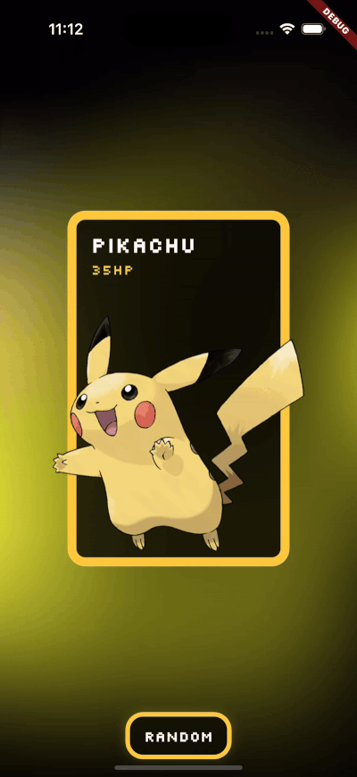
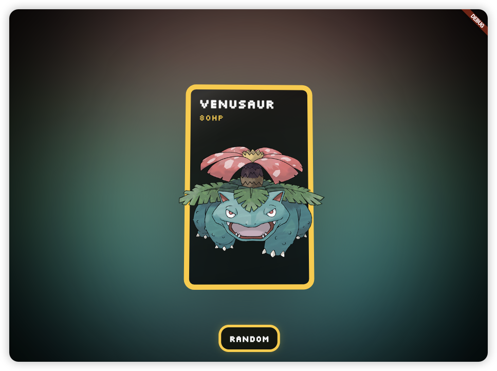

# Flutter 3D pokemon card

Experience Pokémon's charm in a whole new dimension! This project brings a modern 3D twist to classic Pokémon cards, offering a unique visual experience.

## Sample

|Web|iOS|Android|
|:---:|:---:|:---:|
||||

### Web Sample page

    

https://origogi.github.io/flutter-pokemon-3d-card/

## API

[PokeAPI](https://pokeapi.co/) is a RESTful Pokémon API that provides a lot of Pokémon data, including Pokémon, moves, abilities, types, and more.

## State Management Library

    

- Riverpod is a powerful and flexible library for state management and hooks.
- Cache and manage the state of the application using Riverpod.

## Reference

https://codepen.io/andrewmillen/full/jOLELeo
